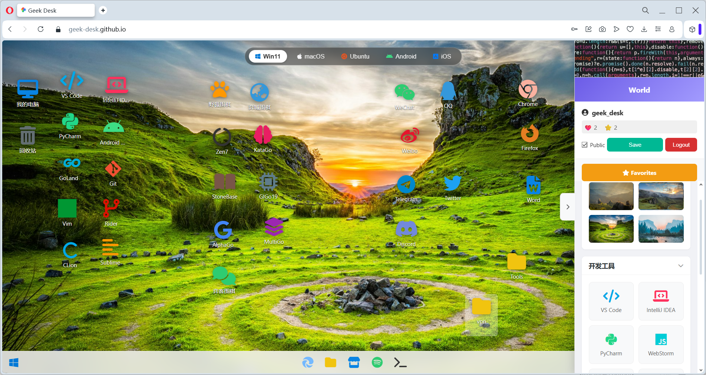
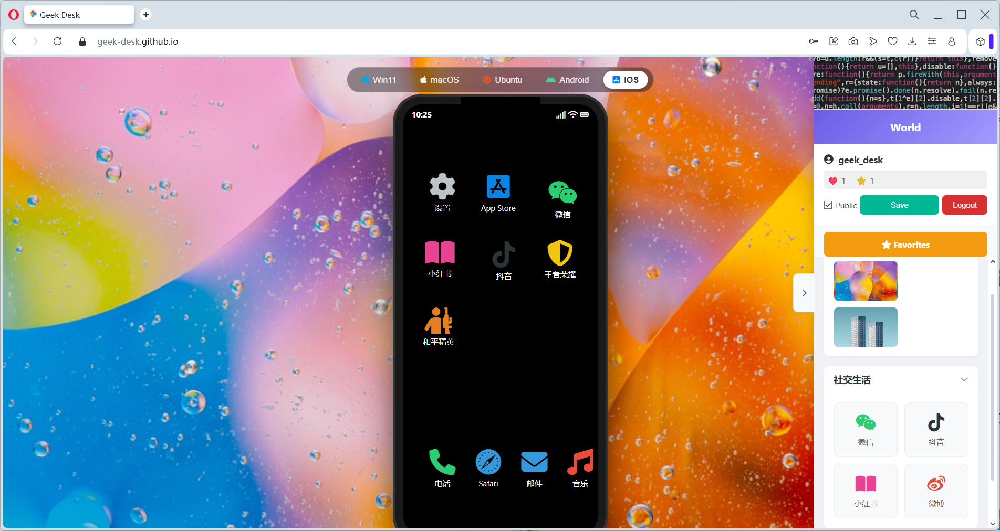

# 🖥️ GeekDesk (极客桌面)

**GeekDesk** is a web-based cloud desktop simulator that brings the experience of Windows, macOS, Ubuntu, Android, and iOS directly to your browser. It allows users to customize their workspace, manage apps, and share their unique desktop setups with the world.

> A "Cloud Desktop" game built with jQuery and Supabase.

 <!-- windows 11 desk -->
 <!-- ios desk -->

## ✨ Features

### 🌍 Multi-OS Simulation
- **5 Operating Systems**: Switch instantly between **Windows 11**, **macOS**, **Ubuntu**, **Android**, and **iOS**.
- **Responsive Design**: 
  - Desktop view features a dual-column toolbar.
  - Mobile view simulates a realistic phone frame with a notch and dynamic scaling.
- **Authentic UI**: Includes simulated Taskbars, Docks, and Status Bars for each OS.

### 🛠️ Customization & Interaction
- **Drag & Drop**: Freely arrange icons on the desktop or drag new apps from the sidebar.
- **Folder System**: Create folders, rename them, and organize your icons (supports drag-and-drop into folders).
- **Context Menu**: Right-click support for creating folders, renaming, and deleting items.
- **Wallpapers**: Built-in high-quality wallpapers for each system, customizable via the toolbar.

### ☁️ Cloud & Social (Powered by Supabase)
- **User Accounts**: Sign up and login via Email (includes verification flow).
- **Cloud Sync**: Your desktop layout, folders, and settings are automatically saved to the cloud.
- **World Plaza**: 
  - Share your desktop setup publicly.
  - View "Hot" and "New" desktops from other users.
  - **Social Interactions**: Like, Collect (Favorite), and Comment on other users' desktops.
- **Privacy Control**: Toggle your desktop between Public/Private visibility.

### 🌐 Internationalization (i18n)
- **Auto-Detect**: Automatically selects English or Chinese based on your browser settings.
- **Manual Switch**: One-click language toggle button.

## 🚀 Tech Stack

- **Frontend**: HTML5, CSS3, JavaScript (ES6+).
- **Library**: jQuery, jQuery UI (for Drag & Drop interactions).
- **Backend / DB**: [Supabase](https://supabase.com/) (PostgreSQL, Auth, Realtime).
- **Icons**: FontAwesome 6.
- **Hosting**: GitHub Pages.

## 📦 Installation & Setup

1. **Clone the repo**
   ```bash
   git clone https://github.com/geek-desk/geek-desk.git
